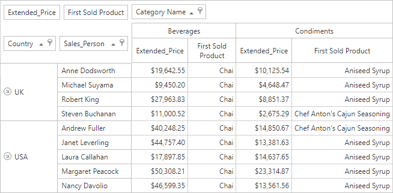

<!-- default badges list -->

[](https://supportcenter.devexpress.com/ticket/details/T1038521)
[](https://docs.devexpress.com/GeneralInformation/403183)
[](#does-this-example-address-your-development-requirementsobjectives)
<!-- default badges end -->


# Pivot Grid for Web Forms - How to Aggregate Data by the Field's First Value

This example shows how to aggregate data by the field's first value.

<!-- default file list -->
## Files to Review

* [WebForm1.aspx](./CS/AspPivot_CustomAggregates/WebForm1.aspx) (VB: [WebForm1.aspx](./VB/AspPivot_CustomAggregates/WebForm1.aspx))
* [WebForm1.aspx.cs](./CS/AspPivot_CustomAggregates/WebForm1.aspx.cs) (VB:[WebForm1.aspx.vb](./VB/AspPivot_CustomAggregates/WebForm1.aspx.vb))
* [FirstValueFunction.cs](./CS/AspPivot_CustomAggregates/FirstValueFunction.cs) (VB: [FirstValueFunction.vb](./VB/AspPivot_CustomAggregates/FirstValueFunction.vb))
<!-- default file list end -->

## Overview

This example adds the `FirstValue([ProductName])` expression to the _First Sold Product_ field. The expression returns the first sold product by _Sales Persons_ in each product category.



| Data Field | Expression |
| --- | --- |
| First Sold Product | ``` FirstValue([ProductName]) ``` |

Call the [CriteriaOperator.RegisterCustomFunction](https://docs.devexpress.com/CoreLibraries/DevExpress.Data.Filtering.CriteriaOperator.RegisterCustomFunction(DevExpress.Data.Filtering.ICustomFunctionOperator)) method to register a custom function in your project (see [WebForm1.aspx.cs](./CS/AspPivot_CustomAggregates/WebForm1.aspx.cs#L8)/[WebForm1.aspx.vb](./VB/AspPivot_CustomAggregates/WebForm1.aspx.vb#L9)).

## Documentation

- [Pivot Grid Expression Syntax](https://docs.devexpress.com/CoreLibraries/120512/devexpress-pivot-grid-core-library/pivot-grid-expression-syntax)
- [ASPxPivotGrid ](https://docs.devexpress.com/AspNet/DevExpress.Web.ASPxPivotGrid.ASPxPivotGrid)

## More Examples

[Pivot Grid for WinForms - How to Aggregate Data by the Field's First Value](https://github.com/DevExpress-Examples/winforms-pivot-grid-custom-aggregates)
<!-- feedback -->
## Does this example address your development requirements/objectives?

[](https://www.devexpress.com/support/examples/survey.xml?utm_source=github&utm_campaign=aspnet-pivot-grid-custom-aggregates&~~~was_helpful=yes) [](https://www.devexpress.com/support/examples/survey.xml?utm_source=github&utm_campaign=aspnet-pivot-grid-custom-aggregates&~~~was_helpful=no)

(you will be redirected to DevExpress.com to submit your response)
<!-- feedback end -->
